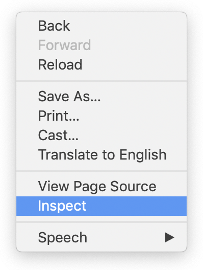
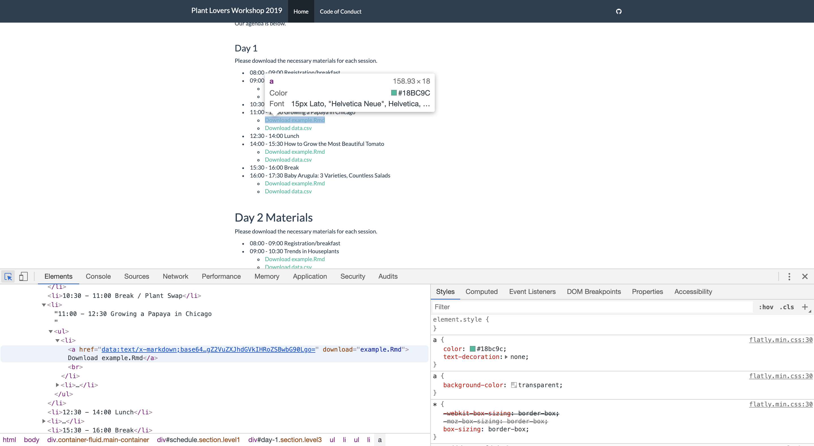
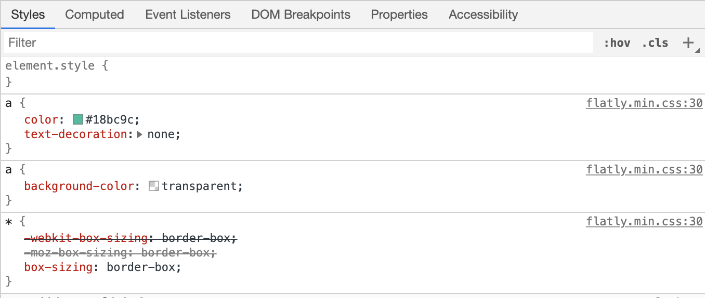
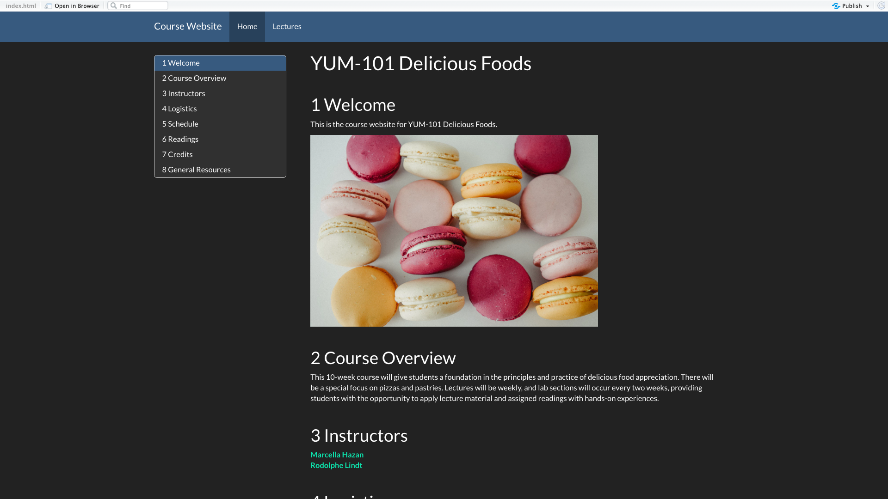
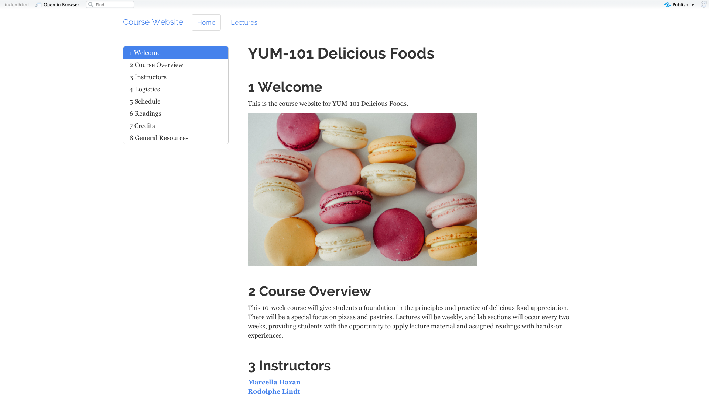
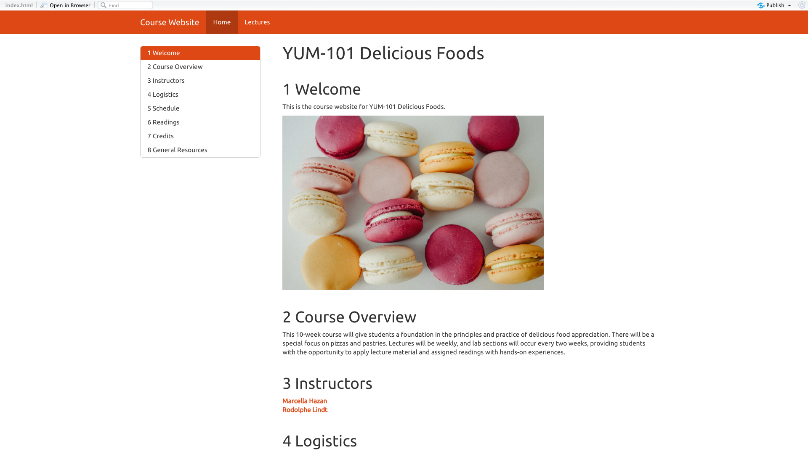
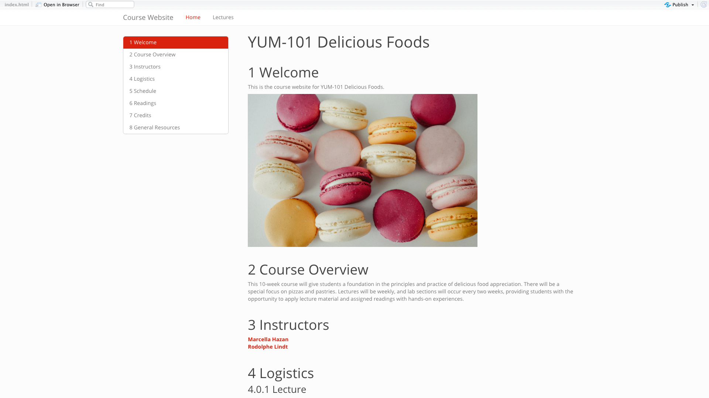

# (APPENDIX) Appendix {-}


# CSS Crash Course {#css-crash}


Every element of a website that you see, from links to pictures to paragraphs, has a category label. These labels can be tags (for example, all links on websites have `a` tags, all big headers have `h1` tags), or they can be IDs or classes (described later).  If you know the label for something on a website, then you can style its appearance by using a `.css` file. In a CSS file, you write style rules that will apply to all elements of the same category. This is a very useful thing to be able to do because it allows you to break free from the limitations of built-in templates and themes that come with R Markdown.

Below is a quick example of some CSS that would change all link colors to the color "orchid" and all link text from being uppercase:


```r
a {
  color: orchid;
  text-transform: uppercase;
}
```

You begin with the element's "label" (technically called a *selector*). Within curly braces, `{ }`, you can include as many different style properties as you'd like for that element. Each new property must end with a `;`.  What are your options for properties to style? [There are many](https://www.w3schools.com/cssref/), but don't feel overwhelmed-- just pick one or two things to change as you start out.

## Determining the right selector

How could you have known that the selector for links was an `a`? The answer is by opening up your existing website, and right-clicking anywhere on the page and clicking on *Inspect* (in Chrome browsers) or *Inspect Element* (in Firefox).

<center> {width=300px} </center>

Clicking on this will open a small set of windows inside of your browser called the Developer Tools (a.k.a "devtools") or the inspector. These give you an inside peek into all the CSS styles that are being applied to every element in the site. (The examples that follow use the Chrome developer tools.)

In the lower left pane of the subwindow, click on the icon of a rectangle with an arrow. Now as you hover and then click on anything in your website, you will see the contents of the developer tools change. The pane on the right shows the CSS styles that are applied. 


[NEED TO SWITCH TO SCREENSHOT WITH COURSE DEMO SITE]
<br>


<br>

Taking a closer look at the CSS pane on the right, we can see that the link we are hovering over does indeed have an `a` as its selector. 

<br>



<br>


One neat thing about the developer tools is that you can click and temporarily edit the CSS properties in this very window and  simlutaneously see the changes take effect on the page. These edits only happen in your browser, so nothing in your R Markdown document will change (in fact, your edits will be lost as soon as you refresh the page in your browser), but editing here is a fast way to test out any CSS ideas.

[ALSO ADD TEXTTRANSFORM IN SCREENSHOT TO MATCH ABOVE EXAMPLE]

<br>


<br>

There's a lot more we could say about CSS here. But it's faster and more rewarding to learn via real examples. Let's start tinkering!

[OTHER TOPICS TO MENTION:]
[1. EXAMPLES OF CLASSES AS CSS SELECTORS. (WHY DO SOME SELECTORS BEGIN WITH . AND OTHERS DON'T?)]
[2. MULTIPLE ATTRIBUTES. COMBINING THEM WITH `.` vs separated by spaces ]


# Timeline

Here we can put weekly goals to make sure we are staying on target. 

Complete by the end of:

Week 12 (Aug 23): Wrap up, refine, style, check --complete book!

Week 11 (Aug 16): Add miscellaneous content (illos, quotes, etc.) / Clean commits, etc.

Week 10 (Aug 9): other rstudio4edu content: Connect, Cloud, etc.

Week 9 (Aug 2): Complete Blogdown cookbook

Week 8 (July 26): Complete Bookdown cookbook

Week 7 (July 19): Work on beginning content: Flowcharts, etc. 
                  * Distill and Fancy RMd

Week 6 (July 12): Complete RMD/ Distill

Week 5 (July 5): Re-worked Package Cookbook / Start Bookdown cookbook

Week 4 (June 28): Outlining RMD tutorial

Week 3 (June 21):

# Outline of Content & Deliverables

## Works in Progress

The table below shows the tutorials that are in progress or soon-to-be in progress.
  
  [WHAT IS THE BEST WAY TO MAKE/ CODE THIS TABLE? ]
  

<!--


<!--html_preserve--><div id="htmlwidget-c65ab1440aa5a1fce7fd" style="width:100%;height:auto;" class="datatables html-widget"></div>
<script type="application/json" data-for="htmlwidget-c65ab1440aa5a1fce7fd">{"x":{"filter":"none","data":[["1","2","3","4","5","6"],["Package","RMD site","RMD site","RMD site","RMD site ","RMD site"],["How to make a package","Basic Fundamentals","Custom Site Tutorial","Custom Site Tutorial","Fancy R Markdown Sites","Fancy R Markdown Sites"],["NA","NA","<a href=\"https://rstudio4edu.github.io/basic-workshop-site/\">Custom Workshop site<\/a>","<a href=\"https://rstudio4edu.github.io/basic-course-website/\"> Custom Course site<\/a>","<a href=\"https://rstudio4edu.github.io/fancy-workshop-site/\">Fancy Workshop site<\/a>","<a href=\"https://rstudio4edu.github.io/fancy-course-site\"> Fancy Course Site<\/a>"],["<a href= \"https://github.com/rstudio4edu/testpackage\">test package<\/a>","TBA","<a href=\"https://rstudio4edu.github.io/basic-workshop-site/\">basic-workshop-site<\/a>","<a href=\"https://github.com/rstudio4edu/basic-course-website\">basic-course-website<\/a>","<a href=\"https://github.com/rstudio4edu/fancy-workshop-site\" >fancy-workshop-site<\/a>","<a href=\"https://github.com/rstudio4edu/fancy-course-site\">fancy-course-site<\/a>"]],"container":"<table class=\"display\">\n  <thead>\n    <tr>\n      <th> <\/th>\n      <th>Tool<\/th>\n      <th>Tutorial<\/th>\n      <th>Demo Site<\/th>\n      <th>Repo<\/th>\n    <\/tr>\n  <\/thead>\n<\/table>","options":{"dom":"t","order":[],"autoWidth":false,"orderClasses":false,"columnDefs":[{"orderable":false,"targets":0}]}},"evals":[],"jsHooks":[]}</script><!--/html_preserve-->

<br>

Now, coding the table a second way, so as not to use HTML explicitly. But now everything is a link.
--> 

<br>


<table class="table table-hover" style="margin-left: auto; margin-right: auto;">
 <thead>
  <tr>
   <th style="text-align:left;"> Tool </th>
   <th style="text-align:left;"> Tutorial </th>
   <th style="text-align:left;"> Demo site </th>
   <th style="text-align:left;"> GitHub repo </th>
  </tr>
 </thead>
<tbody>
  <tr>
   <td style="text-align:left;"> Package </td>
   <td style="text-align:left;"> <a href="intro-dry.html" style="     ">How to make a package</a> </td>
   <td style="text-align:left;"> <a href="NA" style="     ">NA</a> </td>
   <td style="text-align:left;"> <a href="https://github.com/rstudio4edu/testpackage" style="     ">testpackage</a> </td>
  </tr>
  <tr>
   <td style="text-align:left;"> RMD site </td>
   <td style="text-align:left;"> <a href="Basic%20Fundamentals" style="     ">Basic fundamentals</a> </td>
   <td style="text-align:left;"> <a href="NA" style="     ">NA</a> </td>
   <td style="text-align:left;"> <a href="NA" style="     ">NA</a> </td>
  </tr>
  <tr>
   <td style="text-align:left;"> RMD site </td>
   <td style="text-align:left;"> <a href="cookbook-rmd.html" style="     ">Custom site tutorial</a> </td>
   <td style="text-align:left;"> <a href="https://rstudio4edu.github.io/basic-workshop-site/" style="     ">Custom workshop site</a> </td>
   <td style="text-align:left;"> <a href="https://github.com/rstudio4edu/basic-workshop-site" style="     ">basic-workshop-site</a> </td>
  </tr>
  <tr>
   <td style="text-align:left;"> RMD site </td>
   <td style="text-align:left;"> <a href="cookbook-rmd.html" style="     ">Custom site tutorial</a> </td>
   <td style="text-align:left;"> <a href="https://rstudio4edu.github.io/basic-course-website/" style="     ">Custom course site</a> </td>
   <td style="text-align:left;"> <a href="https://github.com/rstudio4edu/basic-course-website" style="     ">basic-course-website</a> </td>
  </tr>
  <tr>
   <td style="text-align:left;"> RMD site </td>
   <td style="text-align:left;"> <a href="cookbook-rmd-fancy.html" style="     ">Fancy R Markdown Sites</a> </td>
   <td style="text-align:left;"> <a href="https://rstudio4edu.github.io/fancy-workshop-site/" style="     ">Fancy workshop site</a> </td>
   <td style="text-align:left;"> <a href="https://github.com/rstudio4edu/fancy-workshop-site" style="     ">fancy-workshop-site</a> </td>
  </tr>
  <tr>
   <td style="text-align:left;"> RMD site </td>
   <td style="text-align:left;"> <a href="cookbook-rmd-fancy.html" style="     ">Fancy R Markdown Sites</a> </td>
   <td style="text-align:left;"> <a href="https://rstudio4edu.github.io/basic-course-distill" style="     ">Fancy course site</a> </td>
   <td style="text-align:left;"> <a href="https://github.com/rstudio4edu/fancy-course-site" style="     ">fancy-course-site</a> </td>
  </tr>
  <tr>
   <td style="text-align:left;"> Distill site </td>
   <td style="text-align:left;"> <a href="cookbook-distill.html" style="     ">Make a Distill site</a> </td>
   <td style="text-align:left;"> <a href="https://rstudio4edu.github.io/basic-course-book" style="     ">Basic course Distill</a> </td>
   <td style="text-align:left;"> <a href="https://github.com/rstudio4edu/basic-course-distill" style="     ">basic-course-distill</a> </td>
  </tr>
  <tr>
   <td style="text-align:left;"> Bookdown </td>
   <td style="text-align:left;"> <a href="cookbook-bookdown.html" style="     ">Make a book</a> </td>
   <td style="text-align:left;"> <a href="NA" style="     ">Basic course book</a> </td>
   <td style="text-align:left;"> <a href="https://github.com/rstudio4edu/basic-course-book" style="     ">basic-course-book</a> </td>
  </tr>
</tbody>
</table>

## Tutorial Descriptions

### Package

* Most basic package will start right off the bat with data. 

   
### R Markdown Basic Fundamentals

* Alison
* Single page tutorial
* Review syntax
      + See: [items to include](https://github.com/rstudio4edu/rmd-tutorial-workshop/issues/5)    
      
### Custom R Markdown Site
* Applies to both workshops and courses
* Customization within YAML including [these items](https://github.com/rstudio4edu/rmd-tutorial-workshop/issues/5)
* In two parts (chapters?): 
  + How to Build it 
  + What to include in it (could be its own chapter-- or two?): content to be tailored for Workshop use and Courses use
      
### Add-on: How to Build a Fancy R Markdown Site
  + Applies to both workshops and courses
  + Covers anything that would require CSS
     
    
# Backlog

Here is a list of items that would be cool to include, but are lower priority. 

<br>

<br>


* Anchor headings

* Copy/ Paste clipboard

* [timer function for workshops]

* Continuous integration? https://github.com/chris-prener/travis-test

* pandoc/ knitr/ addressing a letter version of R Markdown and YAML

# Miscellaneous

* Consistent use of pronouns in the book: our site, your site, we suggest, I suggest....?
* Rmd, R Markdown doc, `.Rmd` -- which to use?
* A growing yaml----show each feature getting added on? Or just focus on the one at hand?


Other pursuits:
* PR to Hugo Academic Themes
* rmd4edu: Template package
* writing function and doing a PR for the roxygen comment stuff for package
* word doc template

# Spillover from distill

**Unique to R Markdown** [ Probably remove]

* `rmarkdown:::site_skeleton(getwd())`
* What happens to Rmd's placed in subdirectories?
    ** They're still knit...but not compiled in an automatic and *smart* way (?)
* A logo can only be added with HTML/CSS-- unless you create your own pandoc template (Ahh!)
* Footer must be constructed using HTML/CSS manually with `includes....` in YAML. And it doesn't go all the way across the page easily. 
* Google analytics need to be inserted manually within HTML file and `includes.. before body` in YAML
* Appendix not an option unless manually built into footer.
* Favicon: can you not do this in r Markdown within the YAML?
* `output: html_document`....or whatever else you want.


# Teaching and Learning with Jupyter Book Review

Here is Desiree's impression of the Jupyter Book. 


__Good stuff__

* Description of the use cases
* Screenshots of examples of activities/questions in notebooks (e.g. in Section [2](https://jupyter4edu.github.io/jupyter-edu-book/why-we-use-jupyter-notebooks.html#why-do-we-use-jupyter).3.22.
* Inclusion of 'pro-tips content' throughout content
* I do like the pedagogical patterns section, though I see how including something like this greatly increases the scope of our project. I think what I like most about it, is that they're concrete examples of creative use-cases.
* The [tips and tricks section](https://jupyter4edu.github.io/jupyter-edu-book/jupyter.html#tips-and-tricks) I find to be useful, practical advice. In thinking of how this applies toour own project, I think a lot of this could be condensed into little "tips" boxes.
* Different ways of running Jupyter w/ pros and cons. Useful for educators to know ahead of time


__Stuff I don't like as much__

* Needs way more color, pictures, graphics. I think there is too much text for this to be an effective way of "selling" the notebooks. You have to read a lot of prefaces before you get to the practical implementations and concrete examples.
* Tone is kinda dry
* Not sure if it's the layout, but I think just by nature of it being a book, it doesn't feel like as a user that I can or should skip around to only the sections I need. It's hard to know which sections will be most useful to me when I "arrive" to this resource.

# General Bookdown Questions

* What is the main takeaway from the `<meta>` tags (slide 25) in the bookdown workshop/tutorial?


# R Markdown Themes {#rmd-themes}

Theme options include the following. Click through the tabs to see what they each look like on our [basic course demo site](https://rstudio4edu.github.io/basic-course-website/).

### `default` 

{width=100%}

### `cerulean`

{width=100%}

### `journal`

{width=100%}


### `flatly`

{width=100%}

### `darkly`

{width=100%}


### `readable`

{width=100%}


### `spacelab`

{width=100%}


### `united`

{width=100%}


### `cosmo`

{width=100%}


### `lumen`

{width=100%}


### `paper`

{width=100%}


### `sandstone`

{width=100%}


### `simplex`

{width=100%}


### `yeti`

{width=100%}


# What should I make {#teach-offer}


<div class='col2'>

1. [Make a data package](#data-pkg)
1. [Make an R Markdown template](#make-rmdtemplate)
1. [Make an R Studio project template](#proj-templates)
1. [Make an interactive tutorial](#learnr)
1. [Make an R Markdown site](#make-rmd)
1. [Make a Distill site](#make-distill)
1. [Make a book](#make-book)
1. [Make a Blogdown site](#make-blogdown)

\

</div>

\


I think that quite early on in this book, we should try to answer the question "I'm an educator...what should/can I make here?".  
I'm not sure whether this should happen here or in the preface, but one way we can do this is with the flowchart. Below is just a *very rough* conceptual sketch of how a flowchart here might be a fun way to give users a visual map of where they could end up after using the rstudio4edu resource. [This is the idea I'm riffing off of.](https://www.beckysimpson.co/flowcharts) 

Needless to say, right now the example below is yucky, too small, and incomplete. And it's also just kind of acting as funny eye-candy. But if we make it nicer (and perhaps summarize it more efficiently with a table beneath it), would this be the spot for it? (Could alternatively place this in the introductory section for the Cookbooks Section--and only include tools that we have cookbooks for (ie. leave out stuff like Connect)).


# Teaching learners {#teach-learners}

+ teaching to make reprexes

+ teaching about community/SO/etc

# What to do on day 1 {#teach-day1}

See: https://github.com/rstudio-education/datascience-box/issues/47

- Link to mine's eat cake first stuff.
- start with a data package (if you can); caveat: you are teaching importing data.
- link to mine's dsinabox, perhaps garrett's latest repro research stuff
- orient to IDE (great tip by kierisi: play with RStudio IDE themes?)
- start with Rmd (if you can)- you can teach minimal markdown etc.

# Licensing your content

Some opinionated guidance.

Does it make sense to move the Licensing section closer to the end of the book-- after they've created new content (or remixed ours or others') with the cookbooks?

# Remixing licensed content

Recommended ways to offer attribution

If you are reusing others' content in say a workshop with slides, add your attributions on the last slide, and include an "Attributions" section in the repository's READ ME file.

So if it’s a workshop, once on the last slide + in the repo readme. 

If it’s a semester long course, just somewhere on the course website

# Community

https://community.rstudio.com/c/teaching
