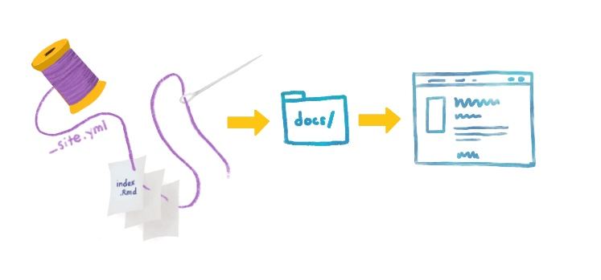
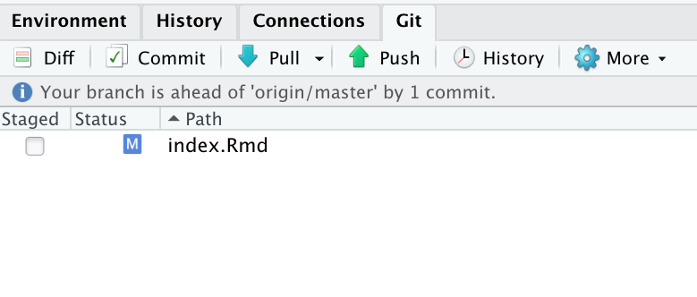
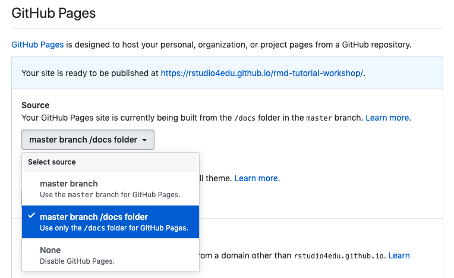

# (PART) Cookbook: R Markdown sites {-}


# Introduction {-#intro-rmd}


This is a cookbook intended for folks who would like to put together a site to help them organize and deliver their teaching materials to learners. An R Markdown site is the most straightforward way to compile a collection of R Markdown documents.

<!--todo: insert screenshots or iframes with links to existing R Markdown sites-->

Using R Markdown project templates, you can put together a bare-bones site in no time at all. Here, we will show you an example of how to do this by making a demo site. You can follow along with this cookbook, or you can download the demo repositories modify as much as you'd like. 


<div class = "side-by-side no-anchor">
<div class = "side1">

<a href="#make-rmd" target="_blank"></a>

</div>
<div class = "side2">

#### [Make a site](#make-rmd)
You will build a bare-bones R Markdown website from a site skeleton and publish it. We make only the most minimal changes to content and style necessary to get you a shareable website.

</div>
</div>

\

<div class = "side-by-side no-anchor">
<div class = "side1">

<a href="#rmd-yours" target="_blank"></a>

</div>
<div class = "side2">

#### [Make it yours](#rmd-yours)
You'll personalize your content here by adding new pages to your site and growing your navigation bar.

</div>
</div>

\

<div class = "side-by-side no-anchor">
<div class = "side1">

<a href="#rmd-care" target="_blank"></a>

</div>
<div class = "side2">

#### [Caring for your site](#rmd-care)
You'll develop a workflow for editing your site, adding new content, and hiding pages that are works-in-progress.

</div>
</div>

\

<div class = "side-by-side no-anchor">
<div class = "side1">

<a href="#rmd-dress" target="_blank"></a>

</div>
<div class = "side2">

#### [Dress it up](#rmd-dress)

Here, you'll find instructions for no-fuss website customizations that leverage built-in features that *do not* rely on knowing, learning, or using CSS.

</div>
</div>

\

<div class = "side-by-side no-anchor">
<div class = "side1">

<a href="#rmd-fancy" target="_blank"></a>

</div>

<div class = "side2">

#### [Make it fancier](#rmd-fancy)

In the final chapter, you'll learn about website customizations that require some CSS and HTML.

</div>
</div>

## What are we making? {-}

We're about to take a collection of (one or more) R Markdown files, create `.html` versions of each, and "knit" them together into a single, navigable website. 

<center></center>


This is not so different from what happens when you work with individual `.Rmd`s. But, there are a few key pieces of magic that separate a directory filled with R Markdown files from a living, breathing website: 


* **A `_site.yml` text file** that will stitch your `.Rmd` documents together and place an official-looking navigation bar at the top of them.

* **An R Markdown file** with the name `index.Rmd` file, which will become your site's homepage.

Additionally, we'll demo how to publish your R Markdown site for free using GitHub Pages, so you'll also need:

* **A `docs/` folder**, which will be the folder that we will use as the "boarding area" for your rendered site files to deploy on GitHub Pages.

* To **turn on GitHub Pages for your repository**.

There are certainly other options for publishing (aka deploying) an R Markdown website. For an overview of other options, you may reference: https://rstudio.github.io/distill/publish_website.html.


## Pros and cons of using Rmd sites {-}


**Pros:**

* **Minimal additions** (really, just 2 files) are needed to go from a collection of regular R Markdown documents to a site.  

* **Minimal software dependencies** (really, only `rmarkdown`) is needed to build your site- no additional software is required.

* **A simple structure** allows you to grow your content and add pages quickly, without having to invest time in learning complicated folder structures to figure out where to put new files.  

* **Ideal for small sites** that do not need complex organization or many pages (i.e. for workshops, a series of online tutorials, or a basic course website).  

* **Easy to customize** without any knowledge of web design or CSS if you're okay sticking to the templates. 


\

**Cons:**

* **Many files lead to chaos** because all `.Rmd` files that go into the site must sit inside the project root directory. That is, you cannot organize them within subdirectories. This means that, as the number of pages increases, your project directory becomes increasingly crowded and difficult to navigate. 


* **CSS and HTML necessary** for moving beyond the limited built-in customization options. Depending on what you enjoy about coding--this might not actually be a con. 


## Is this cookbook for you? {-}


**Pre-requisites:**

* You have a [GitHub account](https://github.com/)
* You are comfortable with the basics of using R and RStudio
* You understand how R projects work
* You understand the difference between a regular R script and an R Markdown document


**What you'll learn:**

* How to compile multiple R Markdown pages into an R Markdown site
* How to add basic customization through themes using built-in options
* Optionally, how to customize your site even further with CSS
* How to publish your R Markdown pages for free via GitHub Pages


\

Let's get started! 


## Other learning resources {-}

* [Lisa Debruine's *Create a simple webpage using R Markdown*](https://debruine.github.io/tutorials/webpages.html): Includes some overview of adding images, changing global style settings, etc.  

* [Emily Zabor's *Creating Website in R*](https://www.emilyzabor.com/cookbooks/rmarkdown_websites_tutorial.html#r_markdown_website_basics): Includes description of how to add a personal domain name.

* [Julia Lowndes' *Making free websites with RStudio's R Markdown*](https://jules32.github.io/rmarkdown-website-tutorial/index.html): A how to that also includes descriptions of the RStudio GUI layout and an overview of Markdown syntax.  

* [Nick Strayer & Lucy D’Agostino McGowan's *How to make an RMarkdown Website*](http://nickstrayer.me/RMarkdown_Sites_tutorial/)  

* [R Markdown: The Definitive Guide](https://bookdown.org/yihui/rmarkdown/rmarkdown-site.html): The official and very thorough, but often technical, resource for R Markdown. Treat this as a reference text.

* [GitHub and Rstudio](https://resources.github.com/whitepapers/github-and-rstudio/): Step-by-step guide on publishing `.Rmd` docs and websites to GitHub, includes working with local branches and using the terminal tab within R. 


# Make a site {#make-rmd}


## tl;dr

This tl;dr is for readers who are already experienced with GitHub and want to see our "cheatsheet" version of the rest of this chapter. If you are looking for screenshots plus some hand-holding, we think you'll benefit from reading the [rest](#rmd-site-setup) of this chapter.

**Here's how you make an R Markdown site from scratch, using a built-in site skeleton as a template:**


1. Start with an empty RStudio project linked to a remote GitHub repository that you can push/pull to from your local copy in RStudio.

1. In your project, create a simple shell for an R Markdown website shell by running the following code in your R console:

    
    ```r
    rmarkdown:::site_skeleton(getwd())
    ```
    
1. Prep for publishing to GitHub Pages by changing the output directory of your website (in your `_site.yml` file) to a folder named `"docs"`.
    
    ```yaml
    name: my-website
    output_dir: docs
    ```
    
    
1. Tell GitHub Pages to bypass using Jekyll to build your site by adding a single empty file named `.nojekyll` to your project root directory.

    
    ```r
    file.create(".nojekyll")
    ```


1. Build your site using the RStudio "Build" pane.

1. Push and commit to send your site online to GitHub- do you see your `.html` files in the `"docs"` folder?

1. Turn on GitHub Pages by going to your repository online. Click on the repository’s settings and under GitHub Pages, change the Source to be the `master branch /docs` folder.

1. Edit your site, build it, then push and commit to GitHub to publish your changes online.

1. Rinse and repeat! Every push to your `master` branch triggers the online version of your site to update.


## Getting set up {#rmd-site-setup}


### Update packages

The only package you need for this cookbook is `rmarkdown`, but if you are using RStudio, you are all set!

:::rstudio-tip
The `rmarkdown` package does not need to be explicitly installed or loaded here, as RStudio automatically does both when needed. 
:::

However, if you haven't updated your package recently (or ever), you can re-install it to make sure you are using the most up-to-date version from CRAN:


```r
# check package version installed
packageVersion("rmarkdown")
# install if update is needed
install.packages("rmarkdown")
```

At the time of publishing, we are running `rmarkdown` version 1.15.

### Make a project {#rmd-proj-first}

For your first R Markdown site, we recommend starting by creating a GitHub repository online first, then making a project in RStudio. 

If this is not your first rodeo, then you could check out the [more advanced GitHub last workflow](#uplevel-rmd)).


We recommend following the tips on [Happy Git with R](https://happygitwithr.com/new-github-first.html) and starting in GitHub before switching to RStudio:

1. [**Create a new repository on GitHub**](https://happygitwithr.com/new-github-first.html#make-a-repo-on-github-2) for your work. 

    + Do *not* initialize the repo with a `.gitignore` or a `README` file (we'll add these later!).  
<br>
1. **Copy the repository URL** to your clipboard. 

    + Do this by clicking the green Clone or Download button.
    
    + Copy the HTTPS clone URL (looks like: `https://github.com/{yourname}/{yourrepo}.git`).
    
    + **Or** copy the SSH URL if you chose to set up SSH keys (looks like: `git@github.com:{yourname}/{yourrepo}.git`).  
<br> 
1. [Create a new RStudio Project via git clone](https://happygitwithr.com/new-github-first.html#new-rstudio-project-via-git-clone). **Open RStudio.** 

    + Do this by clicking *File* > *New Project* > *Version Control*> *Git*. 
    
    + Paste the copied URL. 
    
    + Be intentional about where you tell RStudio to create this new Project.  
<br>
1. **Click Create Project.**

:::tip
Follow these instructions from [Happy Git with R](https://happygitwithr.com/) to start with a new repo on [GitLab](https://happygitwithr.com/new-github-first.html#gitlab) or [Bitbucket](https://happygitwithr.com/new-github-first.html#bitbucket), instead of GitHub.
:::


### Make a site skeleton {#rmd-site-skeleton}

We'll start by creating the shell for a basic R Markdown website and publishing this site to GitHub Pages straight away. In your R console, type and run the following code:


```r
rmarkdown:::site_skeleton(getwd())
```

:::gotcha
Don't miss it! Note that we use `:::` here (with three colons) to generate important infrastructure files we need.

:::

\

You will end up with the following files in your working directory, as shown in Figure \@ref(fig:rmd-site-dir). The most critical files are the `index.Rmd` and the `_site.yml`, and we mention a little about them below. 

<div class="figure" style="text-align: center">

<p class="caption">(\#fig:rmd-site-dir)Site skeleton</p>
</div>


Close RStudio and re-open your site by clicking on the project file (`.Rproj`). When you re-open the project, you may notice the `.Rproj` file shows up in your Git pane, which means that the file has changed since your last commit. What happened? RStudio has detected that you have built a website, so a single line has been added to your `.Rproj` file:

```yaml
BuildType: Website
```

## A mini-orientation {#rmd-site-orientation}

Our skeleton created two out-of-the-box content files for our site: 

1. **`index.Rmd`** Any content in this file will be your site’s homepage. This file must be named `“index.Rmd”`. 

1. **`about.Rmd`** This will be a second, distinct page of your site. This file can have any name, but we will stick to `“about”` for now.

When we build our site, R Markdown will *knit* each of these, and create `.html` (i.e. website-ready) versions of them that we can preview locally. 

The third file in our skeleton, **`_site.yml`**, is *not* a file that gets turned into a site page, but *is* necessary for site setup. 

Nothing to do here, but good to know these things! We'll circle back to editing these files later.

## Push to GitHub {#rmd-push}

Let's get these website files pushed up to our remote repository on GitHub. Do the following from RStudio:

1. **Click *Git* ** in the same RStudio pane that also contains the *Environment* tab.

2. **Check the box(es)** under the "Staged" column and click *Commit*.

3. **Add a commit message** like "initial commit" and then click *Push*.

<center>{width=400px}<center>


## Change output directory {#rmd-site-output}

Now let's make a small change. In order to publish to GitHub Pages, we'll want to send all the rendered site files (i.e., all those ending in `.html`) to our "boarding area", which is the `docs/` folder. We need to edit the `_site.yml` to change this setting.

**Open `_site.yml` and add the following** on its own line at the end:

```yaml
name: my-website
output_dir: docs
```

This step is a one-time step. It says: 
    
> "Please take all of my `.html` files that get made when I *build*, and place them in the `docs/` folder. And if there's not a `docs/` folder, then make one." 
    
Having our HTML files live in `docs/` is necessary for using GitHub pages to make our pages go live, which we'll do soon. You do *not* need this step if you will not be publishing to GitHub Pages.

## Turn off Jekyll {#rmd-site-nojekyll}

This bit is only necessary if you plan to use GitHub Pages for publishing your website. We need to tell GitHub Pages to bypass using Jekyll to build your site. We do this by adding a single empty file named `.nojekyll` to your project root directory.


```r
file.create(".nojekyll")
```

## Build your site {#rmd-site-build}

<a href="#make-rmd" target="_blank"></a>

In the lifecycle of your site, you'll be doing lots of building. What does building the site do? This processes your `.Rmd`s and creates the `docs/` folder (if it doesn't already exist) that houses `.html` versions of each of your `.Rmd` files. AND each of these pages now has a common navigation bar at the top that links your site together (this is thanks to our `_site.yml` file--but more on that later).

In RStudio, you can render your site locally (knit + preview all `.Rmd` files in one fell swoop) from the either the IDE or the R console.

<div class = side-by-side>
<div class = side1>


*From the R console*, you can run: 


```r
rmarkdown::render_site()
```

</div>

<div class = side2>

**OR** *from the IDE*, find the Build tab and select **Build Website**:

<div class="figure" style="text-align: center">
<a href="https://bookdown.org/yihui/rmarkdown/" target="_blank"></a>
<p class="caption">(\#fig:unnamed-chunk-18)The build pane in RStudio</p>
</div>

</div>
</div>

:::tip
If the rendered site does not open up automatically in a new window, you can go to the `docs/` folder in your project, click on the `index.html` file, and `View it in Web Browser`.
:::


## Push to GitHub (again) {#rmd-push2}

Let's get these *new* website files pushed up to our remote repository on GitHub. If you want your site to have the most recent updates you've made, then every single `.Rmd` file with a change must be built right *before* pushing to GitHub. Using either the build pane or `rmarkdown::render_site()`, you don't need to knit each `.Rmd` file one at a time, but you do need to build your site locally first every time.

:::tip
Watch out! Each time you run `rmarkdown::render_site()`, the `docs/` folder will be overwritten with updated HTML versions of your `.Rmd`s. This means DON'T EVER EDIT FILES IN THE `docs/` FOLDER! Nothing catastrophic will happen if you do, but you will overwrite and lose all your changes the next time you knit or `render_site()`.
:::

\
Go ahead and stage all your changed files, commit, and push to GitHub.

:::tip

If at this point you somehow ended up with a folder called `_site/` in your project directory, go ahead and delete it. You don't need it. This is just the default version of the `docs/` folder, and if you have it, it just means you must have knit or rendered your site before we specified `output_dir: "docs"` in `_site.yml`.
:::

<!--todo: we need to tell them how to remove that dir if pushed-->

Now we'll get to the good stuff! Let's put this on the internet!


## Make a living, breathing site! {#rmd-living}

We have built some out-of-the-box content and pushed to GitHub. Now we'll go back to the GitHub website and tell it where to find our website-ready files:


1. **Back on GitHub, click the *Settings* tab** of your project repository.


2. **Scroll down** until you get to "GitHub Pages" and select "master branch/docs folder". (This is why we had to set up `output_dir: docs` in our `site.yml` file previously. If your file doesn't end up in the `docs/` folder, GitHub pages won't find it.)

<center>{width=600px}</center>

\

3. **Congratulations! A url is generated**--this is your website address. You can share it, tweet it, send it to your mom--it's now live!


4. **Add this url to the repo description** so that it's easy to find. 

<center>{width=80%}</center>

\
\

Now that the bare bones of the site are up, you can go back and add more content to your R Markdown documents anytime. Your changes will go live as soon as you build or `render_site()`, followed by a push to GitHub. 


## Uplevel your workflow {#rmd-uplevel}

We followed a "GitHub first" workflow above, but if you'll be using GitHub regularly, we recommend evolving this workflow. 


First, install the [`usethis` package](https://usethis.r-lib.org/):


```r
install.packages("usethis")
```

Then load it to use it:


```r
library(usethis)
```

\

Now, follow the instructions from [Happy Git with R for setting up a GitHub personal access token or PAT](https://happygitwithr.com/github-pat.html).

:::gotcha
Be sure to restart your R session after setting up the PAT, and pay close attention that your `.Renviron` file has at least one empty line at the bottom.
:::

\

Once you have a GitHub PAT set up in your `.Renviron` file, you can stay in the comfort of your project in the RStudio IDE to do all the GitHub things we were doing before online in your browser. 

Now, here is your advanced workflow for creating a new R Markdown site inside a project:


1. **Click** *File* > *New Project* > *New Directory*

1. **Scroll down and select** *Simple R Markdown Website*

1. Then use your R console to **run** this code: 

    
    ```r
    use_git()
    use_github() # you have to have a PAT setup
    ```
    
1. Then follow all of our instructions above starting at [changing the site output directory](#rmd-site-output).
